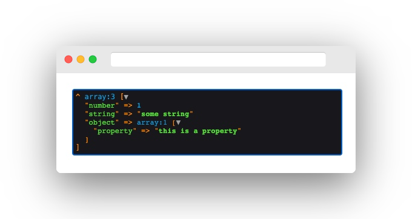

# Symfony Dump Twig Filter plugin for Craft CMS 3.x

Symfony Dump Twig Filter allows using the `dump` twig filter in your craft templates for better debugging.

## Requirements

This plugin requires Craft CMS 3.0.0 or later.

## Installation

To install the plugin, follow these instructions.

1. Open your terminal and go to your Craft project:

    ```bash
    cd /path/to/project
    ```

2. Then tell Composer to load the plugin:

    ```bash
    composer require gustavs-gutmanis/craft-symfony-dump
    ```

3. In the Control Panel, go to Settings → Plugins and click the “Install” button for `Symfony Dump Twig Filter`.

## Using Symfony Dump Twig Filter

Once the plugin is installed, you can use it in any of your twig templates to output debugging information.

``` twig


{{ myData|dump }}
```

This will yield the following result in your browser:



You can use the Symfony Dump filter on any object in twig.
